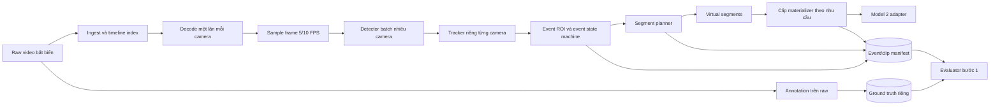

# Kiến trúc đề xuất cuối cho bước 1

> **Phân biệt trạng thái:** Phần 0.1 mô tả code đang chạy trong repository.
> Các mục sau là kiến trúc mục tiêu/pilot được khuyến nghị; thành phần nào
> chưa có trong phần 0.1 không được xem là đã triển khai.

## 0.1 Hiện đã triển khai

### Bộ lọc MOG2 tùy chọn trước YOLO

Khi `motion_gate_enabled=true`, pipeline áp MOG2 lên từng frame đã lấy mẫu
ở bản thu nhỏ (mặc định rộng 320 px), chỉ tính tiền cảnh trong ROI cấu hình;
không có ROI thì dùng toàn frame. YOLO + ByteTrack vẫn là detector/tracker
quyết định event. Gate luôn gọi YOLO trong 1 giây khởi động, khi MOG2 thấy
chuyển động và 1,5 giây sau đó, khi EventEngine còn track đang mở, hoặc tới
nhịp dò định kỳ 0,5 giây. Các frame còn lại chỉ cập nhật MOG2 và EventEngine
với detection rỗng; frame raw vẫn được đi qua để giữ timeline. Nếu OpenCV
MOG2 lỗi, pipeline tắt gate cho phần còn lại của run và gọi YOLO mỗi frame.
Mỗi run tự tạo MOG2 và ByteTrack, không chia sẻ trạng thái giữa camera/run.
Tính năng mặc định tắt để các run cũ giữ hành vi; web, CLI và GUI có công
tắc bật. `detections.jsonl` đánh dấu `detector_skipped`; `run.json` ghi số
frame gọi YOLO và số frame bỏ qua. OCR, CV–VLM và xuất clip vẫn chạy tuần tự
sau lõi bước 1, không dùng mặt nạ MOG2 làm nhãn hoặc GT. Gate giảm số lần
YOLO ở camera yên; nó không giảm số frame raw phải đọc/giải mã để kiểm tra.

Ngoài PyQt/CLI, repository đã có web local tách React frontend, FastAPI
backend, SQLite/filesystem storage và mặc định hai worker nền. Web có trang tổng quan,
upload video, cấu hình/vẽ ROI-line/chạy pipeline, và kết quả/HITL/review.
Backend gọi nguyên `parking_step1.run_pipeline`; lõi CV không phụ thuộc web.
Web local dùng hai worker mặc định để xử lý hai run độc lập cùng lúc; mỗi run
có cấu hình, detector/model và thư mục artifact riêng. Các run vượt số worker
chờ trong hàng đợi; mức song song đổi bằng `PARKING_WEB_MAX_WORKERS`.
Pipeline ghi `runtime.json` sau các nhánh để lưu tổng thời gian và ba chặng
phát hiện/cắt clip, OCR, CV–VLM. Evaluator đọc artifact này cùng thời lượng
raw từ video metadata để hiển thị chi phí thời gian; không ghi ngược vào GT.
Run mới còn ghi profile thời gian bên trong ba chặng để tách giải mã video,
model, OCR/VLM và xuất MP4.
Evaluator dùng profile để trừ thời gian nạp model khỏi từng chặng và tổng chi
phí xử lý hiển thị; artifact `runtime.json` vẫn giữ nguyên thời gian wall-clock.
Run thiếu profile không được suy đoán chi phí xử lý.
Khi chỉ có một segment vật lý, `clip_final.mp4`
được sao chép từ MP4 segment đã mã hóa: cùng byte, hash, frame và timeline;
không giải mã raw và mã hóa lại lần thứ hai. Với nhiều segment, pipeline vẫn
nối theo thứ tự thời gian. Đường xuất clip ưu tiên FFmpeg/libx264 CPU
(`ultrafast`, H.264/yuv420p): giải mã đúng các frame thuộc segment và mã hóa
MP4 có `faststart`. Clip bắt đầu muộn seek gần frame đầu và đối chiếu frame
đầu/cuối với raw; nếu seek lệch thì thử lại bằng cách đếm frame từ đầu.
Nếu FFmpeg thiếu hoặc đầu ra không vượt kiểm tra số frame, FPS và decode,
pipeline quay về OpenCV `mp4v`. Khi nhiều segment đều do
FFmpeg tạo, final dùng concat demuxer và sao chép luồng H.264 đã nén, không
mã hóa lại; trường hợp còn lại dùng đường OpenCV cũ. Quy tắc start/end frame,
timeline raw, event và manifests giữ nguyên; byte/codec MP4 có thể đổi.
Chi tiết tại [`kien_truc_web_local.md`](kien_truc_web_local.md).
Web reviewer lưu GT đã duyệt riêng với artifact dự đoán. Module
`parking_web.metrics` đọc hai phía và `clips.jsonl` trên timeline raw để
chấm event đúng loại/thời gian, tỷ lệ giữ clip, OCR và điều kiện; điểm trên
event ghép và điểm end-to-end được tách riêng. Hungarian của SciPy chỉ dùng
cho GT độc lập có nhiều cặp ứng viên; nhãn gắn event nguồn giữ đúng liên kết
đó, GT thêm cho xe bỏ sót không được ghép ngược với event khác. Evaluator
web là bước đọc artifact sau Step 1, không tác động detector/worker.

Sau khi ghi event và detection, nhánh `Plate Enrichment` tùy chọn đọc lại
raw frame và box của đúng `track_id` trong event. YOLO Open Images phát hiện
biển trong crop xe; bộ chọn frame xếp hạng theo confidence, độ nét, kích thước,
phơi sáng/tương phản và diện tích tương đối, rồi giữ các frame cách nhau theo
`plate_min_gap_ms`. PaddleOCR nhận dạng crop biển; consensus theo chuỗi chuẩn
hóa tạo gợi ý HITL. Nhánh này ghi `plate_observations.jsonl` riêng, không sửa
`events.jsonl` hay ground truth. Có thể chạy lại nhánh bằng `run_plate.py`.
Plate detector hiện gom tối đa 8 crop xe liên tiếp trong cùng event để gọi YOLO
một lần, trả kết quả theo đúng thứ tự crop rồi mới chấm chất lượng và chọn frame.
OCR vẫn chạy trên các frame được chọn như trước. Lô giới hạn 8 crop để bộ nhớ
không tăng theo cả video. Với crop có kích thước khác nhau, cách padding khi
YOLO chạy batch có thể đổi box/confidence so với suy luận từng crop; vì vậy
artifact gợi ý có thể khác dù model và raw không đổi.
Plate và Condition dùng `SequentialFrameReader`: khi frame kế tiếp ở phía
trước, OpenCV `grab` qua các frame giữa và chỉ `read` đúng frame cần dùng;
chỉ seek khi quay về frame cũ. Cách này giữ nguyên pixel crop/box/timestamp
nhưng tránh seek codec ở từng detection. Frame không được giữ hàng loạt trong
RAM, nên bộ nhớ không tăng theo độ dài video.
Plate Enrichment còn giữ tạm crop biển có padding 5% trong RAM, tối đa 64 MiB
cho mỗi event, ngay khi frame nguồn được đọc để phát hiện biển. Sau khi chọn
top-K, PaddleOCR dùng crop này thay vì seek ngược raw; candidate không được
cache do vượt giới hạn vẫn đọc lại raw theo đường cũ. Cache không vào JSONL
và không thay ảnh đầu vào OCR.
Model biển số và OCR đều đổi được qua cấu hình. Nhánh `Condition Enrichment`
tùy chọn đọc lại raw frame đại diện cho từng event (ưu tiên frame đã chọn ở
Plate Enrichment, fallback sang detection của track), đo sáng/độ nét bằng CV,
ghép scene/vehicle/plate thành contact sheet cho Qwen3-VL-2B-Instruct. Fusion
đánh giá khả năng đọc trước: đọc được thì trạng thái `good` và không có điều
kiện lỗi; không đọc được mới phân loại `capture_blur`, `plate_obstruction`
hoặc `lighting_issue`. Không còn taxonomy detail. Nếu OCR đọc cùng một chuỗi
ở ít nhất hai frame với confidence cao, kết quả được coi là đọc được và các
nguyên nhân lỗi chỉ được lưu ở phần suppressed để kiểm tra. Nhánh này ghi `condition_suggestions.jsonl`
riêng, không sửa `events.jsonl` hay ground truth; GUI chỉ nạp làm gợi ý HITL.
Có thể chạy lại bằng `run_conditions.py` hoặc nút trong GUI. Phân tích tuần tự
từng event, không có queue/retry; lỗi model dừng nhánh và báo lỗi. Chưa hiệu
chỉnh ngưỡng CV hoặc kiểm chứng độ chính xác trên bộ GT lớn. Việc tải weights
VLM là bước cài đặt riêng, không nằm trong repository.
PaddleOCR/PaddleX và Qwen cùng dùng Transformers nhưng Qwen chạy PyTorch;
runtime đặt `USE_TF=0` và `TRANSFORMERS_NO_TF=1` trước import model để tránh
Transformers nạp TensorFlow/h5py không cần thiết và xung đột ABI NumPy.

Code hiện tại chạy offline cho **một camera và một làn trong mỗi run**:

```text
OpenCV tuần tự: `read()` frame được lấy mẫu, `grab()` frame bỏ qua
→ YOLO26s (car/motorcycle/bicycle) → ByteTrack
→ EventEngine (ROI/line corridor/motion gate/crossing/grace) → segment planner
→ JSONL manifests + detections.jsonl → materialize từng MP4 tùy chọn
→ nối các MP4 theo thời gian nguồn thành clip_final.mp4
```

Lịch lấy mẫu vẫn dựa vào `frame_index/source_fps`; chỉ thay cách OpenCV đi
qua frame không đưa vào detector. `grab()` không tạo ảnh BGR cho frame bỏ qua,
nhưng decoder vẫn phải đi qua video tuần tự. Các nhánh xuất MP4, OCR và
CV–VLM tiếp tục đọc raw theo cách riêng, không dùng ảnh từ vòng detector.

Giao diện PyQt6 và CLI nằm trong `src/parking_step1/`; GUI có trình phát
nhúng dùng OpenCV/QTimer để chọn event, tua tới event start và xem MP4 hoặc
virtual segment; artifact box/track được vẽ trực tiếp trên frame. Khi tua,
track của event đang chọn được giữ bằng detection gần nhất trong khoảng event,
trong khi phần buffer không bị gán box cũ. Tab cấu hình
giữ raw video ở pane bên phải và sau khi chạy tự chuyển sang tab kết quả. CLI có thêm
`BatchConfig` để chạy tuần tự nhiều camera/làn, nhưng không dùng chung trạng
thái tracker. Output gồm
`run.json`, `events.jsonl`, `clips.jsonl` và thư mục `clips/` nếu bật xuất
MP4. Khi có segment vật lý, `clip_final.mp4` nối toàn bộ segment theo
`start_ms` nguồn; `run.json` giữ ánh xạ từng đoạn trên timeline final về
`clip_id` và raw timestamp. GT được đánh dấu độc lập trên raw và evaluator pilot chạy riêng. Chưa
có ingest nhiều file, queue/worker song song, Model 2 adapter hoặc ghép
ENTRY–EXIT. Chi tiết bằng chứng và lệnh chạy ở
[`trang_thai_trien_khai.md`](trang_thai_trien_khai.md).

Khi có crossing line, EventEngine luôn dùng corridor có bán kính chuẩn hóa
`line_gate_margin` làm cổng mở event. Nếu có thêm ROI, cổng hợp lệ là phần
giao `ROI ∩ corridor`; line vẫn đánh dấu crossing. Khi chỉ có ROI hoặc không
có hình nào, motion gate là cơ chế chính loại xe đỗ.

Validation cấu hình yêu cầu crossing line phải nằm trong, cắt qua hoặc chạm
biên ROI khi hai hình cùng tồn tại. Line hoàn toàn ngoài ROI là lỗi cấu hình;
việc corridor mở rộng chạm ROI không làm cấu hình đó hợp lệ. GUI chặn chạy,
lưu hoặc mở config và hiển thị nguyên nhân; khi vẽ trực tiếp, line sai được
cảnh báo và xóa ngay sau điểm thứ hai.

Trong mọi chế độ ROI/line, track mới còn phải vượt motion gate mới trở thành
event: anchor đáy box dịch chuyển ít nhất `min_motion_distance` trong
`motion_window_seconds`. Candidate đứng yên được giữ để quan sát nhưng không
được xuất. Cửa sổ candidate được cuộn lại để xe đỗ lâu rồi bắt đầu chạy có
`start_ms` gần lúc chuyển động. Sau khi active, xe được phép dừng chờ và vẫn
được giữ qua grace period.

## 0.2 Thiết kế mục tiêu/chưa triển khai

Các phần dưới đây mô tả kiến trúc mở rộng sau pilot: timeline nhiều file,
batch detector nhiều camera, storage/queue production, adapter Model 2 và
annotation/report đầy đủ. Đây là mục tiêu thiết kế, chưa phải cam kết rằng
đã có code.

## 1. Quyết định chính

Bước 1 nên được giữ gọn với một nhiệm vụ: **tìm các khoảng video có lượt xe đi qua và bảo toàn cơ hội đọc biển số cho bước 2**. Không đưa OCR, ghép lượt vào–ra, phân tích lỗi ký tự hoặc tự động suy luận toàn bộ điều kiện vào luồng chính của bước 1.

Phương pháp khởi đầu phù hợp nhất là:

```text
Vehicle detector → ByteTrack → Lane ROI/Event state machine → Segment planner
```

- Detector chỉ tìm ba lớp `car`, `motorcycle`, `bicycle`.
- `bicycle` dừng sau event/clip; Plate/Condition Enrichment ghi
  `not_applicable` và không gọi detector biển, OCR, CV hoặc VLM.
- ByteTrack duy trì cùng một xe qua nhiều frame và qua các lần detector hụt ngắn.
- ROI và máy trạng thái quyết định khi nào một lượt bắt đầu/kết thúc.
- Segment planner tạo khoảng thời gian cần giữ cùng buffer trước/sau.
- Clip chỉ được ghi thành file vật lý khi cần; trước đó có thể là một đoạn ảo trỏ về video raw.

Không cần huấn luyện Model 1 riêng ngay từ đầu. Đo baseline pretrained trên pilot trước; chỉ fine-tune khi dữ liệu chỉ ra rõ detector bỏ sót nhóm xe hoặc điều kiện nào.

## 2. Phạm vi được giảm tải

### Luồng chính bước 1 phải làm

- Đọc video và giữ timeline nguồn chính xác.
- Phát hiện/theo dõi xe trong từng camera.
- Lấy `lane_id` và `direction` trực tiếp từ camera registry; mỗi camera đã gắn với đúng một làn cố định.
- Tạo `event_id` và khoảng thời gian của từng lượt xe.
- Tạo đoạn video ảo hoặc MP4 với buffer đầu/cuối.
- Ghi metadata tối thiểu và kiểm tra clip đọc được.
- Lưu thông tin phiên bản model/config để tái lập.

### Xử lý nền hoặc tùy chọn

- Chọn 1–3 frame đại diện.
- Lưu box/track theo frame cho tập pilot, ca lỗi hoặc tập chẩn đoán.
- Tính checksum, thống kê confidence và báo cáo tài nguyên.
- Materialize event-focused clip nếu Model 2 yêu cầu một xe trên một video.

### Nằm ngoài luồng chính bước 1

- Ground truth biển số và điều kiện quan sát do người gán nhãn.
- OCR và confidence biển số của Model 2.
- CER, confusion ký tự và kết luận đúng/sai.
- Ghép một lượt vào với một lượt ra trên toàn bãi.
- Tự động phân loại biển bẩn/chói/mờ trong phiên bản đầu.

Các trường đầy đủ trong định dạng dữ liệu vẫn cần thiết, nhưng nhiều trường được tạo ở luồng annotation/evaluation hoặc được kế thừa từ `run.json`, không cần tính lại trên từng frame.

## 3. Kiến trúc tổng thể



### 3.1 Raw storage và timeline index

- Video gốc là nguồn sự thật, lưu bất biến trong thời gian đánh giá.
- Index chứa camera, thời gian UTC, đường dẫn, checksum, codec, FPS và khoảng mất dữ liệu.
- File liên tiếp của cùng camera được nhìn như một timeline logic để không đếm trùng xe ở ranh giới file.

### 3.2 Camera processing worker

Mỗi camera có một worker logic, nhưng detector có thể batch frame của nhiều camera trên cùng GPU:

1. Decode video đúng một lần.
2. Lấy frame cho detector ở tốc độ cấu hình, khởi đầu thử 5 và 10 FPS.
3. Detector chạy batch để tận dụng GPU.
4. Tracker/state machine vẫn giữ trạng thái riêng cho từng camera.

Mỗi camera hiện chỉ nhìn một làn. Worker đọc `lane_id` và `direction` từ camera registry rồi gắn trực tiếp vào mọi event của camera đó. ROI chỉ dùng xác định vùng xe xuất hiện/crossing và loại nền; không cần module phân loại track sang nhiều làn.

### 3.3 Detector và tracker

- Dùng detector phương tiện pretrained thuộc họ YOLO hoặc detector tương đương có tốc độ phù hợp phần cứng.
- Chỉ giữ `bicycle`, `motorcycle`, `car`; các detection thuộc lớp khác không được tạo event.
- Chọn kích thước model bằng benchmark thực tế; không mặc định model lớn nhất là tốt nhất.
- ByteTrack chạy trên các frame đã sample; dependency runtime `lap` được cài
  cùng `ultralytics`; không giảm FPS của video được giao cho Model 2.
- Dùng confidence candidate tương đối thấp, sau đó lọc bằng track tồn tại đủ lâu và quan hệ với ROI.

Background subtraction chỉ nên là baseline hoặc tín hiệu phụ. Nếu dùng làm cổng tiết kiệm compute, phải chạy detector heartbeat định kỳ để xe dừng hoặc chuyển động nhỏ không bị bỏ vĩnh viễn. Không dùng chuyển động làm cổng duy nhất trước khi đạt recall trên validation.

### 3.4 Lane event engine

Mỗi track đi qua máy trạng thái:

```text
OUTSIDE → CANDIDATE → ACTIVE → LEAVING → CLOSED
```

- Xác nhận `ACTIVE` khi track đủ ổn định, giao ROI đúng quy tắc và anchor đã
  dịch chuyển qua ngưỡng cấu hình trong cửa sổ xác nhận.
- Trong `ACTIVE`, tiếp tục giữ event khi xe dừng trước barrier.
- Sang `LEAVING` khi mất detection/rời ROI; grace period cho phép track quay lại mà không sinh event mới.
- `CLOSED` khi rời đủ lâu hoặc có bằng chứng crossing hoàn tất.

Tách hai khái niệm:

- `presence`: dùng để giữ đủ video.
- `crossing`: dùng để đếm một lượt xe.

Tách như vậy tránh trường hợp xe đứng chờ chưa crossing nhưng video đã bị ngắt.

### 3.5 Segment planner và clip materializer

Segment planner chỉ tạo bản ghi:

```text
camera_id + source_start_ms + source_end_ms + event_ids
```

Nó cộng `pre_buffer`, `post_buffer`, gộp khoảng chồng lấn và giữ ánh xạ về raw. Đây là **virtual segment**, gần như không tốn thêm dung lượng.

Clip materializer chỉ sinh MP4 khi:

- Model 2 bắt buộc nhận file;
- người gán nhãn cần xem clip tiện hơn;
- cần đóng gói báo cáo/bàn giao.

Ưu tiên stream copy/GOP-aligned segment nếu độ chính xác biên và khả năng giải mã đáp ứng. Nếu phải re-encode để cắt đúng frame, dùng cấu hình chất lượng cao đã được kiểm chứng không làm giảm kết quả Model 2. Luôn giữ raw để có thể sinh lại clip.

Pilot hiện tại còn tạo `clips/clip_final.mp4` khi bật materialize và có ít
nhất một segment. Segment được sắp theo `start_ms` trên raw rồi nối liền;
khoảng trống giữa hai segment bị bỏ. Bảng
`run.json.artifacts.final_clip.timeline_mapping` giữ offset đầu/cuối của mỗi
`clip_id` trên clip final và timestamp tương ứng trên raw để bảo toàn truy vết.

## 4. Hai mức manifest

### Manifest tối thiểu trên đường nóng

Chỉ cần ghi:

- `run_id`, `event_id`, `clip_id`;
- site/camera/lane/direction;
- thời gian event và segment;
- source reference;
- loại xe/confidence tóm tắt;
- phiên bản detector/tracker/config;
- trạng thái QC.

### Dữ liệu mở rộng ngoài đường nóng

- Media probe đầy đủ được tính sau khi clip được materialize.
- SHA-256 tính theo batch nền nếu không cần giao file ngay.
- Conditions và plate ground truth thuộc annotation store.
- Track box chi tiết lưu trong artifact nén và chỉ giữ lâu cho pilot/ca lỗi.
- Các trường dùng chung như model version, threshold, phần cứng đặt trong `run.json`; event chỉ tham chiếu `run_id` để tránh lặp dữ liệu.

## 5. Luồng giao cho Model 2

Kiến trúc nên có một `Model2Adapter` độc lập với bước cắt:

- Nếu Model 2 hỗ trợ video nhiều xe và trả timestamp/box/track: gửi clip gộp.
- Nếu Model 2 trả một biển số cho một video: adapter tạo event-focused clip từ virtual segment, một event mỗi input.
- Nếu Model 2 hỗ trợ stream/frame: adapter đọc trực tiếp khoảng raw mà không cần ghi MP4 trung gian.

Nhờ adapter, thay giao diện Model 2 không phải sửa detector/tracker/event engine.

## 6. Cách giảm compute và dung lượng mà không mất chất lượng

1. **Decode một lần:** cùng frame phục vụ detector, tracker và frame selector.
2. **Sample cho Model 1, giữ video gốc cho Model 2:** detector chạy 5/10 FPS nhưng clip vẫn giữ FPS/độ phân giải nguồn.
3. **Batch nhiều camera:** gom frame cùng kích thước gần nhau để chạy detector GPU.
4. **Virtual segment trước:** không nhân bản video cho đến khi thực sự cần.
5. **Gộp đoạn chồng lấn:** hai xe sát nhau dùng một parent clip, rồi adapter tách logical event khi cần.
6. **Lưu artifact có chọn lọc:** track chi tiết cho pilot, lỗi và mẫu audit; manifest tóm tắt cho toàn bộ dữ liệu.
7. **Cấu hình theo camera:** ROI loại nền giúp giảm false positive mà không cần model phức tạp.
8. **Conditions trong GT do người xác nhận:** nhánh CV + VLM tạo gợi ý riêng;
   người gán xác nhận `good` hoặc `unreadable`; trường hợp unreadable mới chọn
   một hoặc nhiều trong ba nguyên nhân cấp cao.

## 7. Các pha triển khai

### Pha 1 — pilot tối thiểu

- 2–4 camera đại diện cho ENTRY/EXIT.
- Raw timeline index và công cụ vẽ ROI.
- Detector pretrained + ByteTrack + event state machine.
- Virtual segment và manifest tối thiểu.
- Ground truth event/readable interval trên 300–500 lượt.
- Evaluator event recall, readable retention, false clips/hour và video reduction.

### Pha 2 — ổn định và tối ưu

- Batch inference nhiều camera.
- Clip materializer và Model2Adapter.
- Xử lý file boundary, mất frame, restart và event dài.
- Thử 5/10 FPS, threshold, grace period và buffer trên validation.
- Fine-tune detector chỉ khi baseline có nhóm lỗi rõ ràng.

### Pha 3 — mở rộng vận hành

- Queue/job orchestration, retry và giám sát tài nguyên.
- Metadata database hoặc Parquet cho truy vấn lớn; vẫn xuất JSONL cho bàn giao/tái lập.
- Annotation UI, dashboard lỗi và versioning dataset.
- Scale thêm camera và chính sách lưu trữ raw/clip theo nhu cầu.

## 8. Tiêu chí chọn cấu hình cuối

Không chọn bằng FPS hoặc video reduction đơn lẻ. Thứ tự quyết định:

1. Event recall đạt mục tiêu trên toàn bộ làn quan trọng.
2. Readable-opportunity retention đạt mục tiêu, đặc biệt với xe máy và ban đêm.
3. Start/end loss và duplicate/merge error nằm trong giới hạn.
4. Trong các cấu hình đạt chất lượng, chọn cấu hình có runtime, GPU và dung lượng tốt nhất.

Cần báo riêng theo camera/làn/ENTRY/EXIT, loại xe, ngày/đêm và ca nhiều xe sát nhau. Cấu hình tốt ở một camera không tự động được coi là tốt cho camera có góc nhìn khác.

## 9. Kiến trúc được khuyến nghị sau cùng

```text
Raw immutable video
  ├─ Timeline/metadata index
  ├─ Camera worker: decode → sample → detector → tracker
  ├─ Lane event engine: presence + crossing state
  ├─ Segment planner: virtual segments + buffers + merge
  ├─ Manifest store: clip/event/run metadata
  ├─ On-demand clip materializer
  └─ Model2Adapter

Separate evaluation plane
  ├─ Human annotation on raw video
  ├─ Ground-truth store + conditions
  ├─ Step-1 evaluator
  └─ Error viewer/report
```

Đây là kiến trúc cân bằng tốt nhất ở thời điểm hiện tại: đường xử lý chính đủ nhẹ để mở rộng nhiều camera, raw video và timeline vẫn bảo toàn để đánh giá, còn annotation/conditions/report được tách riêng để không làm chậm hoặc làm phức tạp Model 1.

## 10. Lựa chọn model cụ thể cho pilot

Ngày chốt đề xuất: 16/09/2026.

### Cấu hình chính

```text
Detector: YOLO26s Detect, one-to-many head có NMS
Tracker: ByteTrack
Input detector: thử 640, 960 và 1280; ưu tiên bắt đầu 960
Sampling detector: thử 5 FPS và 10 FPS; ưu tiên bắt đầu 10 FPS
Video giao Model 2: giữ FPS và độ phân giải nguồn
Classes: bicycle, motorcycle, car
```

Lý do chọn:

- YOLO26 là dòng model released mới nhất được Ultralytics khuyến nghị cho dự án mới tại thời điểm chốt; bản `s` cân bằng độ chính xác/tốc độ tốt hơn `n` mà vẫn gọn hơn `m/l/x`.
- Dùng one-to-many head mặc định ở pilot vì tài liệu YOLO26 cho biết nhánh này thường có độ chính xác cao hơn nhánh end-to-end NMS-free. Sau khi đạt recall mới thử NMS-free để giảm latency.
- ByteTrack ít overhead, không cần ReID hay camera-motion compensation; phù hợp camera cố định và một làn có ít xe đồng thời. Nó còn sử dụng detection confidence thấp để cứu track, phù hợp mục tiêu hạn chế bỏ sót.

Không coi benchmark COCO là bằng chứng model tốt nhất cho bãi xe. Phải đo event recall/readable retention trên dữ liệu camera thật.

### Cấu hình theo tài nguyên

| Điều kiện | Detector đề xuất | Tracker | Ghi chú |
|---|---|---|---|
| CPU hoặc GPU rất hạn chế | YOLO26n | ByteTrack | Dùng làm baseline tốc độ; kiểm tra kỹ xe máy nhỏ/xa |
| GPU tầm trung, cấu hình pilot chính | YOLO26s | ByteTrack | Lựa chọn bắt đầu khuyến nghị |
| GPU đủ mạnh, recall quan trọng hơn chi phí | YOLO26m | ByteTrack | So trực tiếp với `s`; chỉ chọn nếu recall tăng có ý nghĩa |
| Nhiều che khuất/ID switch trong cùng camera | YOLO26s/m | TrackTrack hoặc BoT-SORT | Chỉ bật sau khi ByteTrack bộc lộ lỗi; ReID tăng chi phí |
| Cần implementation detector có license Apache-2.0 | RT-DETRv2-S/M official | ByteTrack | Benchmark cùng input/protocol với YOLO26 |

Ultralytics công bố code/model YOLO26 theo AGPL-3.0 và Enterprise; cần chọn license phù hợp trước khi tích hợp sản phẩm. Repository chính thức RT-DETR sử dụng Apache License 2.0. Đây là yếu tố triển khai, không phải metric chất lượng model.

### Khi nào fine-tune

Chạy pretrained trước trên pilot. Fine-tune detector khi một trong các lỗi lặp lại đủ nhiều:

- bỏ sót xe máy nhỏ hoặc bị che;
- nhầm barrier/người/bóng thành phương tiện;
- giảm recall rõ vào ban đêm/ngược sáng;
- camera có góc nhìn khác đáng kể COCO;
- loại xe đặc thù không nằm đúng taxonomy pretrained.

Fine-tune trên train, chọn threshold/input size trên validation và chỉ báo kết quả cuối trên test khóa kín. Không huấn luyện trực tiếp trên test.

### Ma trận benchmark tối thiểu

| Detector | Input | Detector FPS | Tracker |
|---|---:|---:|---|
| YOLO26n | 640/960 | 5/10 | ByteTrack |
| YOLO26s | 640/960/1280 | 5/10 | ByteTrack |
| YOLO26m | 960/1280 | 5/10 | ByteTrack |
| Detector tốt nhất ở trên | cấu hình tốt nhất | cấu hình tốt nhất | TrackTrack hoặc BoT-SORT nếu cần |

Chọn theo thứ tự event recall, readable-opportunity retention, lỗi merge/duplicate, rồi mới tới runtime/GPU/video reduction. Không cần chạy mọi tổ hợp nếu cấu hình nhỏ đã không đạt recall hoặc cấu hình lớn vượt giới hạn tài nguyên rõ ràng.

Nguồn tham khảo cho quyết định model/tracker:

- [Ultralytics YOLO26](https://docs.ultralytics.com/models/yolo26)
- [Ultralytics tracking modes và lựa chọn tracker](https://docs.ultralytics.com/modes/track)
- [ByteTrack official repository/paper](https://github.com/FoundationVision/ByteTrack)
- [RT-DETRv2 paper](https://arxiv.org/abs/2407.17140)
- [RT-DETR official repository](https://github.com/lyuwenyu/RT-DETR)
