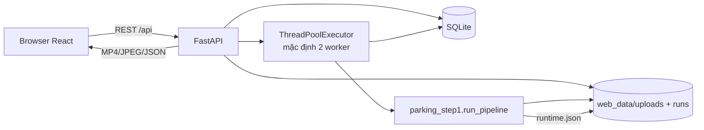

# Kiến trúc web local

## Hiện đã triển khai

Web local tách mã nguồn thành backend FastAPI và frontend React. Lõi CV
`parking_step1` không phụ thuộc web và vẫn được dùng chung bởi CLI/PyQt.
Pipeline ghi `runtime.json` sau khi hoàn tất các nhánh bật trong run; trang
Đánh giá đọc file này qua API để hiện thời gian xử lý tổng. Run cũ chỉ có
`run.json.elapsed_seconds` được ghi trước OCR/CV–VLM nên API gắn nhãn
`step1_core_only` thay vì coi đó là thời gian tổng.



### Thành phần

- `frontend/`: React, TypeScript, Vite và CSS responsive. Build production
  nằm tại `frontend/dist` và được FastAPI phục vụ ở `/`.
- `src/parking_web/api.py`: REST API upload, frame preview, validation, run,
  tiến trình, result, media, annotation và review.
- `src/parking_web/storage.py`: SQLite và filesystem repository.
- `src/parking_web/jobs.py`: hàng đợi local bằng `ThreadPoolExecutor` mặc định
  hai worker (`PARKING_WEB_MAX_WORKERS` chỉnh số worker); mỗi worker gọi một
  `run_pipeline` với config/model và thư mục artifact riêng. Run vượt số
  worker vẫn có hàng SQLite `QUEUED` và sẽ bắt đầu khi có worker trống. Cờ hủy
  được kiểm tra trước khi bắt đầu job, trong vòng đọc/ghi frame và trước khi
  hoàn tất; pipeline báo `run_dir` sớm để run bị hủy vẫn truy được artifact
  dở dang và có thể xóa ở trang Kết quả & duyệt.
- `run_web_api.py`: entry point local tại `http://127.0.0.1:8000`.

### Bảy trang frontend

1. **Tổng quan**: số video, run, event, run đã duyệt và hoạt động gần đây.
2. **Kho video**: upload raw video và xem metadata/danh sách.
3. **Chạy phân tích**: mở đầu bằng bảng mọi run và trạng thái/tiến độ cập nhật
   định kỳ. `Tạo run mới` mở màn cấu hình video, camera/làn/chiều, ROI/line,
   detector và enrichment; sau khi gửi job thì trở về bảng. Có thể tạo thêm
   run khi run khác đang chạy. Bảng cho dừng run chờ/chạy, mở kết quả hoàn
   thành hoặc xóa run terminal.
4. **Kết quả & duyệt** có hai màn hình. Màn hình đầu chỉ liệt kê run
   `COMPLETED`, với
   trạng thái pipeline, trạng thái duyệt, số event/clip và hai thao tác
   `Chỉnh sửa`/`Duyệt`/`Xóa`. Nút `Xóa` yêu cầu xác nhận và gọi
   `DELETE /api/runs/{id}`; backend chỉ nhận run terminal, xóa thư mục artifact
   thuộc `web_data/runs`, các nhãn GT trong SQLite và hàng run. Raw upload
   dùng chung được giữ. `Duyệt` chỉ thành công khi run đã hoàn thành và mọi
   event đã có GT. `Chỉnh sửa` mở màn hình thứ hai ngay trong trang, gồm bảng
   event chỉnh trực tiếp, final clip/các clip và video event kèm overlay
   ByteTrack; nút `Cập nhật` ở cuối bảng chỉ bật khi GT khác bản vừa tải/lưu.
   Mở workspace hoặc quay lại danh sách không đổi trạng thái duyệt. Khi lưu
   GT thay đổi của run `REVIEWED`, backend chuyển run sang `DRAFT`; nếu dữ liệu
   gửi lên không đổi thì vẫn giữ `REVIEWED`.
   Bảng GT có thể thêm hàng `GT-000001`… trực tiếp từ timeline raw cho lượt xe
   Model 1 bỏ sót. Hàng này có `source_event_id=null`, được lưu cùng các hàng
   gắn event dự đoán và được tính vào recall sau duyệt. Người dùng có thể xóa
   event dự đoán sai khỏi GT và khôi phục trước khi lưu; SQLite giữ dấu đã
   loại để hoàn tất duyệt, còn `ground_truth.jsonl` chỉ chứa hàng GT hợp lệ.
5. **Đánh giá** có hai màn hình. Màn đầu là bảng các run `REVIEWED` với video,
   thời gian, camera/làn, số event model và nút `Chi tiết`. Chỉ khi bấm nút
   này frontend mới gọi evaluator trên GT cuối cùng và gợi ý gốc, hiển thị
   precision/recall/F1 của event, OCR và nhãn điều kiện; metric giữ clip,
   sai số thời gian, IoU, đúng loại xe và đúng trạng thái good/unreadable.
   OCR/điều kiện có điểm trên cặp ghép và điểm toàn pipeline để thấy tác động
   của event bị bỏ sót. Nút `Danh sách run`
   trở lại bảng và làm mới danh sách. Giao diện không hiển thị chẩn đoán
   `ambiguous_unlinked_pairs`; API vẫn trả trường này và loại cặp độc lập
   mơ hồ khỏi phép chấm OCR/điều kiện.
   Màn chi tiết trình bày theo luồng **event và giữ clip → OCR → CV–VLM**;
   metric chi tiết và điểm toàn pipeline của từng nhánh nằm cùng một phần.
   Frontend tạo nhận xét bằng quy tắc từ response metric của run, không gọi
   model sinh văn bản hoặc ghi nhận xét vào backend. Trường hợp thiếu mẫu,
   GT chưa đủ nhãn hoặc nhánh chưa chạy được diễn giải riêng; nhận xét không
   thay đổi phép tính hay dữ liệu GT.
6. **Tài liệu**: hướng dẫn upload → chạy → gán GT →
   duyệt → đánh giá; giải thích công thức và cách đọc từng metric theo đúng
   thứ tự event/clip, OCR, CV–VLM. Ngưỡng hiển thị lấy từ cài đặt hiện hành.
7. **Cài đặt**: chỉnh và lưu mặc định nâng cao cho run mới (model, kích thước
   detector, grace/buffer/gộp clip, OCR, VLM) cùng ngưỡng đánh giá. Hai mục ở
   cuối sidebar ngay trên trạng thái backend. Frontend đọc `GET /api/settings`,
   gửi toàn bộ settings tới `PUT /api/settings`; backend xác thực bằng Pydantic
   rồi lưu một bản trong SQLite. Run hiện có giữ snapshot cấu hình trong
   `runs.config_json`; chỉ run mới dùng mặc định vừa lưu. Các ngưỡng đánh giá
   không lưu kèm từng run: đổi ngưỡng làm điểm run đã duyệt được tính lại khi
   gọi evaluator; GT và dự đoán không đổi.

Event preview phát video raw qua `/api/videos/{video_id}/media`, tua tới
`event.start_ms` trên timeline nguồn và tra `detections.jsonl` bằng chính
`video.currentTime`. API result cũng đưa `plate_observations` của đúng event
từ `plate_observations.jsonl`; frontend vẽ box biển màu vàng khi timestamp
observation cách frame đang xem tối đa 150 ms. Box xe màu xanh lấy từ
`detections.jsonl`. Giao diện ghi rõ player đang phát video raw đầy đủ; nút
`Video final` và các clip ở trên mở bản xem trước H.264 qua `?preview=true`.
`src/parking_web/media.py` kiểm tra codec nguồn, chuyển MP4 `FMP4/mp4v` thành
bản xem trước tối đa 960 px rộng và cache theo SHA-256 trong `.browser_media`
của run. File nguồn `clips/*.mp4` và `clip_final.mp4` không đổi; API media
không có tham số `preview` vẫn trả file gốc đầy đủ độ phân giải cho consumer.
Event preview tiếp tục dùng raw video để overlay đúng timestamp.
Canvas overlay được đặt đúng trên phần hình của thẻ video khi player có viền
đen trên/dưới; tọa độ box pixel raw được nhân theo kích thước hình đang phát.
Khi timestamp raw nằm ngoài `[event.start_ms, event.end_ms)`, canvas được xóa
và không vẽ box xe/biển của event đang chọn. Một thanh tua bổ sung dưới video
hiển thị toàn bộ thời lượng raw, tô vàng đúng khoảng event và đánh dấu vị trí
hiện tại; người dùng vẫn tua được tới mọi thời điểm của video raw.

Các trang được mount một lần trong `App` rồi chuyển đổi bằng thuộc tính
`hidden`. Vì vậy, khi đi qua lại bằng sidebar, React giữ nguyên state trong
bộ nhớ của từng trang: video/config/ROI/line ở trang chạy, run đang theo dõi,
run và event đang chọn, cùng các ô GT chưa lưu ở màn hình chỉnh sửa. Khi mở
một run từ Tổng quan hoặc sau khi chạy xong, `selectedRun` ở `App` mở thẳng
màn hình chỉnh sửa của run đó.
State UI chưa được ghi vào `localStorage` hay backend, nên reload tab hoặc
khởi động lại frontend vẫn đưa các giá trị chưa lưu về mặc định; GT đã bấm
`Cập nhật` và dữ liệu run vẫn được giữ trong SQLite/artifact như trước.

### Trạng thái run và review

```text
QUEUED → RUNNING → COMPLETED
                 ↘ FAILED
                 ↘ CANCELLED

DRAFT → REVIEWED → DRAFT (lưu GT đã sửa hoặc gọi reopen tường minh)
```

Backend không giữ model trong request HTTP. Request tạo run trả ngay một
`WEB-*`; worker xử lý tuần tự và frontend poll trạng thái mỗi giây. Đây là
queue local trong memory, chưa có retry/resume sau khi process backend dừng.

### Storage

```text
web_data/
├── parking_web.sqlite3
├── uploads/VID-*/raw-video
└── runs/step1-*/
    ├── run.json
    ├── events.jsonl
    ├── clips.jsonl
    ├── detections.jsonl
    ├── ground_truth.jsonl
    └── clips/
```

SQLite lưu catalog video, trạng thái run, annotation hiện hành và một bản
`app_settings` gồm mặc định run + ngưỡng đánh giá. Manifest
Step 1 vẫn là artifact chuẩn. Khi cập nhật bảng HITL, backend đồng thời ghi
`ground_truth.jsonl` trong run để CLI/evaluator có thể sử dụng. Endpoint đánh
giá đọc các artifact gợi ý bất biến và GT đã duyệt, không chạy lại model; chỉ
cho phép đọc khi trạng thái là `REVIEWED`. Ghép event một-một cùng
camera/làn/chiều, temporal IoU theo ngưỡng cài đặt (mặc định ≥0,30), tôn trọng `source_event_id` và GT thêm
thủ công cho xe bỏ sót. Dùng tối ưu toàn cục khi GT độc lập có nhiều ứng viên.
Clip retention dùng hợp khoảng thời gian clip và GT trên raw timeline, tách
khỏi event F1. OCR/điều kiện báo điểm trên cặp ghép lẫn end-to-end; các cặp
không rõ danh tính không dùng cho nhãn biển/điều kiện. Artifact thiếu thì nhánh
tương ứng hiện chưa chạy. Queue/worker không tham gia đánh giá.

## API hiện tại

| Method | Endpoint | Chức năng |
|---|---|---|
| GET | `/api/dashboard` | Số liệu và hoạt động gần đây |
| GET/PUT | `/api/settings` | Đọc/lưu mặc định run nâng cao và ngưỡng đánh giá; schema `0.1.0` |
| GET/POST | `/api/videos` | Danh sách/upload binary video |
| GET | `/api/videos/{id}/frame` | JPEG frame cho canvas |
| POST | `/api/configs/validate` | Validation dùng chung `RunConfig` |
| GET/POST | `/api/runs` | Danh sách/tạo job |
| GET | `/api/runs/{id}` | Progress và trạng thái |
| POST | `/api/runs/{id}/cancel` | Gửi tín hiệu dừng run `QUEUED`/`RUNNING`; trạng thái chuyển `CANCELLED` khi worker xác nhận |
| DELETE | `/api/runs/{id}` | Xóa run terminal, annotation và thư mục artifact; giữ video raw |
| GET | `/api/runs/{id}/result` | Manifest, clip, event, plate observations, GT hợp lệ và thời lượng raw |
| GET | `/api/runs/{id}/detections` | Detection trong khoảng raw timeline |
| GET | `/api/runs/{id}/media/{path}` | File gốc; `?preview=true` trả bản H.264 tương thích browser và cache trong run |
| POST | `/api/runs/{id}/export.xlsx` | Tạo Excel từ snapshot hàng GT gửi lên, kèm frame có box khi có detection |
| PUT | `/api/runs/{id}/annotations` | Lưu GT theo lô; chỉ chuyển `REVIEWED` sang `DRAFT` khi nội dung thay đổi |
| POST | `/api/runs/{id}/review` | Kiểm tra đủ GT và chuyển `REVIEWED` |
| POST | `/api/runs/{id}/reopen` | Mở khóa chỉnh sửa |
| GET | `/api/runs/{id}/evaluation` | Metric trên GT đã duyệt và gợi ý gốc |

Upload dùng body `application/octet-stream` và header `X-Filename`; không cần
`python-multipart`. Backend chuẩn hóa basename, probe video trước khi đưa vào
catalog và từ chối extension/file không hợp lệ. Media run được kiểm tra path
đã resolve phải nằm trong thư mục run để tránh đọc file ngoài workspace.

Trong màn hình chỉnh sửa GT hiện tại, frontend dùng `reviewPriority.ts` để
xếp các event dự đoán theo quy tắc kiểm tra: GT thêm thủ công, dấu hiệu event
không qua line/chưa xác nhận chuyển động/chồng thời gian đáng kể/ít detection,
rồi tới
OCR chưa có biển và điều kiện chưa có kết quả hoặc gợi ý khó đọc. Đây chỉ là
thứ tự hiển thị, tính từ artifact dự đoán và cấu hình run; không sửa GT, API,
pipeline hoặc xem điểm ưu tiên là xác suất lỗi. Có thể lọc theo nhóm và đổi về
thứ tự thời gian. Chồng lấn đáng kể yêu cầu đồng thời giao ≥500 ms và ≥20%
thời lượng event ngắn hơn, trong cùng camera/làn.
Ngoài ra, bảng đọc `confidence_mean` và `hits` có sẵn trong `events.jsonl`
qua API result để hiện điểm detector phương tiện trung bình theo frame và
sắp xếp thấp–cao. GT thủ công/artifact thiếu điểm xếp sau các event có điểm;
điểm này không gộp với OCR/VLM và không sửa artifact.

Nút Xuất Excel gửi snapshot form GT hiện tại tới backend. Module
`parking_web.export_excel` chỉ đọc raw video, `events.jsonl`,
`detections.jsonl` và `plate_observations.jsonl`; chọn frame trong thời gian
GT, vẽ box hiện có và nhúng PNG vào workbook `.xlsx` tạo trong bộ nhớ.
Endpoint tải về không ghi GT, không cần chạy lại model và không thay
artifact. Hàng GT thủ công chưa có track/box nên ảnh chỉ có frame raw.

Điểm `Độ dễ (0–1)` mới là heuristic hiển thị của frontend, đọc các bằng chứng
gốc qua API result. Với xe có ba nhánh bật, công thức là
`0,35 × vehicle + 0,30 × plate_ocr + 0,35 × cv_vlm`:

- `vehicle`: `events.jsonl.confidence_mean` (trung bình confidence detector
  phương tiện trên các frame cùng track).
- `plate_ocr = 0,5 × plate_detector + 0,5 × ocr_evidence`;
  `plate_detector` là trung bình tối đa ba `plate_confidence` cao nhất của
  event, `ocr_evidence = consensus.confidence × min(1, support_count/2)`.
  Consensus confidence là tỷ phần phiếu, không phải xác suất OCR đúng.
- `cv_vlm = 0,4 × cv_clean_fraction + 0,4 × vlm_readable + 0,2 ×
  fused_plate_readable`. `cv_clean_fraction` là tỷ phần frame CV không gợi ý
  nguyên nhân lỗi; hai cờ đọc được dùng giá trị 1/0.

Các thành phần được chặn trong [0,1]. Nhánh tắt và nhánh không áp dụng cho
`bicycle` bị bỏ khỏi mẫu số và trọng số còn lại được chuẩn hóa lại. Nhánh đã
bật nhưng chưa có kết quả cho điểm thành phần 0 và được ghi là chưa có bằng
chứng, không âm thầm coi là dễ. GT thêm thủ công hiện `—`. Điểm này dùng
để xếp việc duyệt, chưa hiệu chuẩn với GT; giá trị cao không chứng minh
pipeline đúng và không thay metric đánh giá.

## Thiết kế mục tiêu/chưa triển khai

- PostgreSQL và Redis/Celery cho nhiều backend/worker, retry và resume.
- Authentication, phân quyền annotator/reviewer và audit log từng lần sửa.
- Object storage, quota và upload theo chunk cho video rất lớn.
- SSE/WebSocket; bản local hiện poll trạng thái mỗi giây.
- Xử lý cache bản xem trước giữa nhiều backend và chính sách dọn cache tự động;
  bản local hiện dùng khóa trong một process và giữ cache trong run.
- Audit log reviewer và công cụ vẽ vùng xe/biển cho GT thủ công; bản hiện tại
  có thể thêm event GT bằng thời gian raw nhưng chưa gán hộp không gian.
